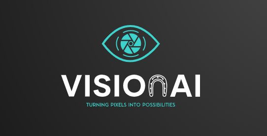
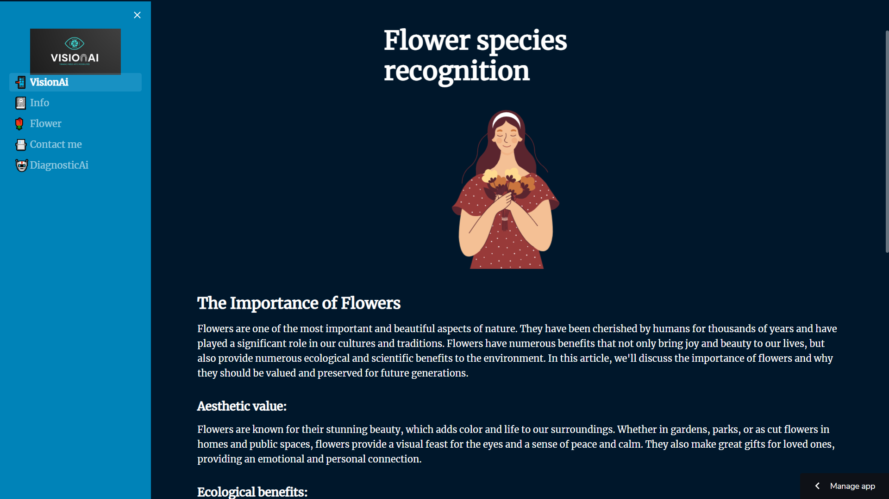
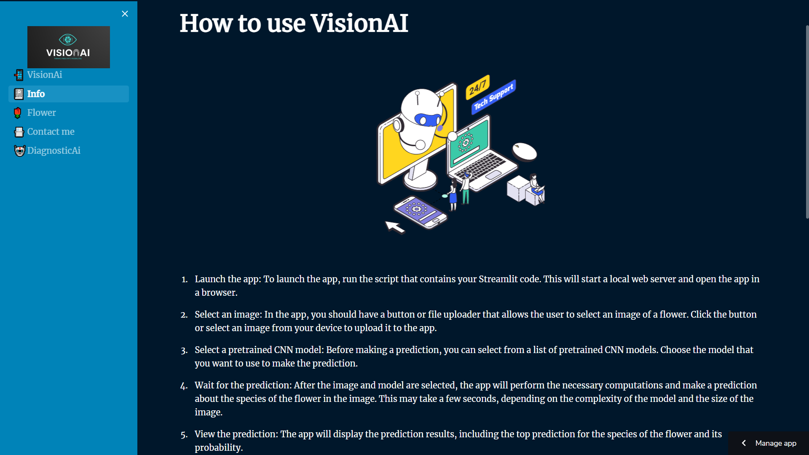
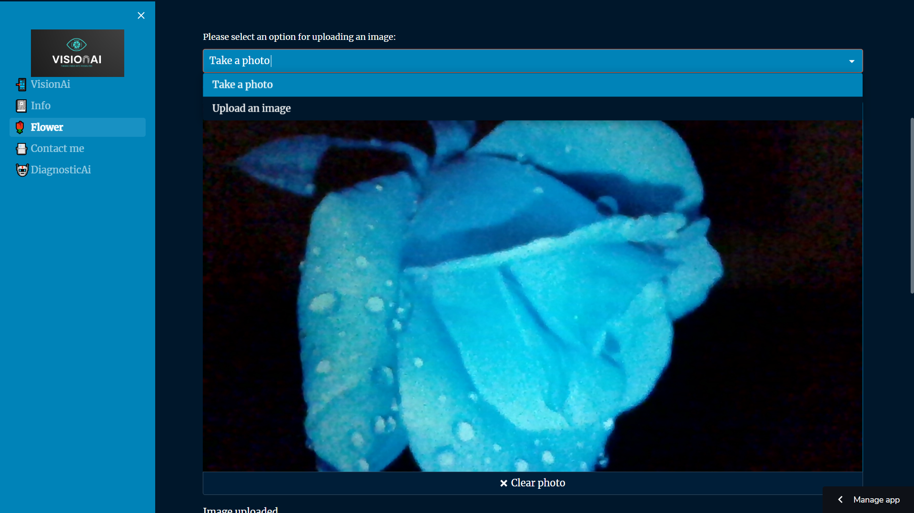
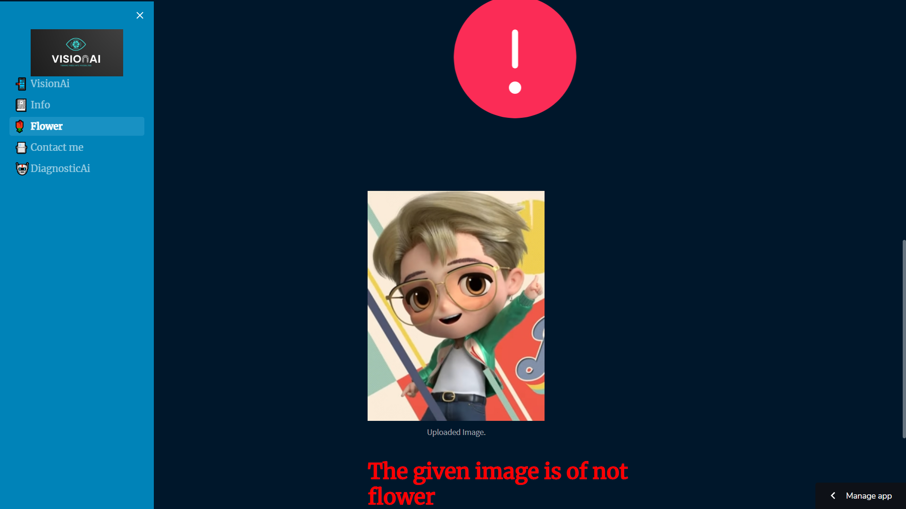
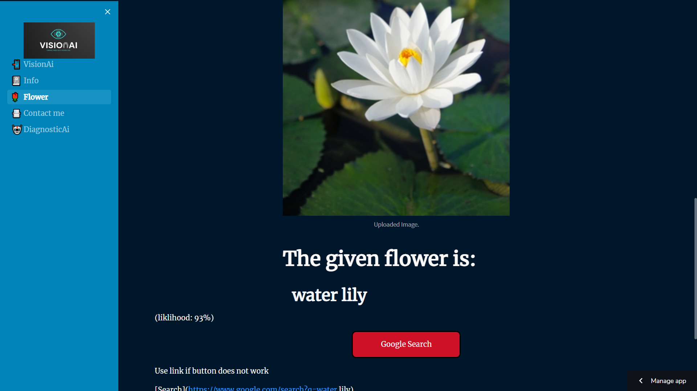
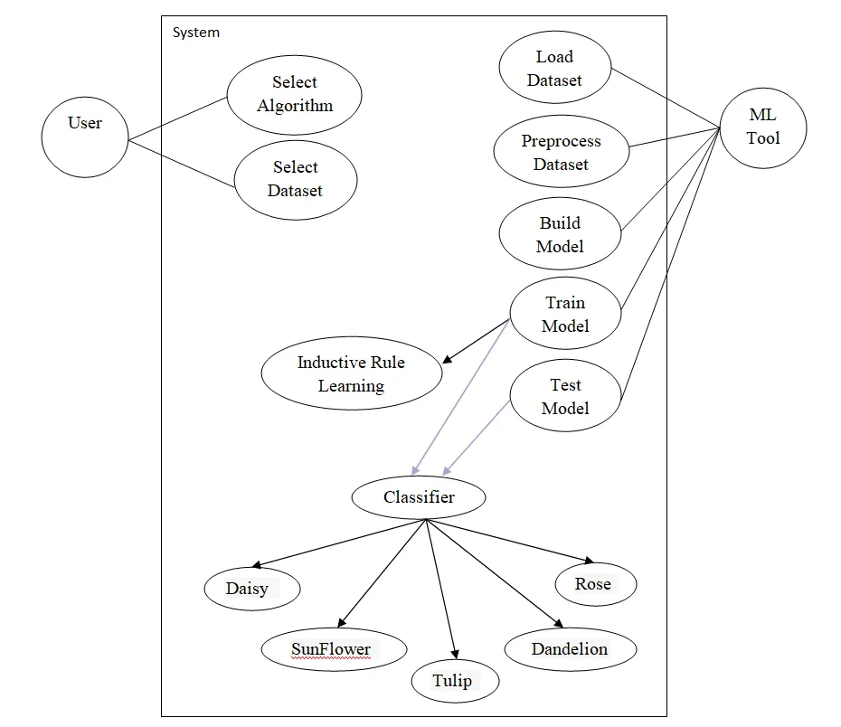

# VisionAI - Image Classification Web App

  

## Introduction
VisionAI is a powerful image classification web application that uses state-of-the-art computer vision techniques to classify more than 102 distinct species with accuracy greater than 75%. This application is built using PyTorch and is deployed as a Streamlit web app. It utilizes a pre-trained VGG19 network and has been trained on large datasets to achieve its high accuracy.

## Table of Contents
- Features
- Installation
- Usage
- Working of the Web App
- Screenshots
- Models
- Datasets
- Deployment
- Requirements
- Use case
- Contributing
- License

## Features
- Classify more than 102 distinct species with accuracy greater than 75%.
- User-friendly interface for easy navigation and usage.
- Deployed as a Streamlit web app for convenient access.
- Utilizes pre-trained VGG19 network for improved accuracy.
- Trained on large datasets for robust performance.

## Installation

### Clone the repository:
$ git clone https://github.com/1Abneesh/VisionAi.git

### Install the required packages:
$ pip install -r requirements.txt

### Run the application:
$ streamlit run app.py

## Usage
- Upload an image of a species you want to classify.
- The app will display the prediction for the species.
- Repeat the process for different images.

## Working of the Web App
The web app takes an image as input and passes it through a pre-trained VGG19 network. The network outputs the prediction for the species present in the image. The app then displays the prediction to the user.

## Screenshots

  

  

  

<h2>

 Red sign and Message if the image is not of flower with sign.

</h2>

  

<h2>

Flower name with percentage accuracy and a google link for more information

</h2>

  

## Models
The app utilizes the VGG19 network, a popular convolutional neural network architecture for image classification tasks.

## Datasets
The app was trained on a large dataset of images for various species. The dataset was split into training and validation sets for efficient model training.

## Deployment
The app is deployed as a Streamlit web app and can be easily run on any local machine.

## Requirements
- Pillow==9.3.0
- streamlit==1.16.0
- streamlit_option_menu==0.3.2
- scikit-learn==1.0.2
- tensorflow==2.11.0
- streamlit-lottie==0.0.3
- matplotlib==3.5.3
- plotly==5.9.0
- torch==1.11.0
- torchvision==0.12.0

## Use case

  

## Contributing
If you want to contribute to the development of VisionAI, feel free to fork the repository and submit a pull request.

## License
VisionAI is licensed under the MIT license.

